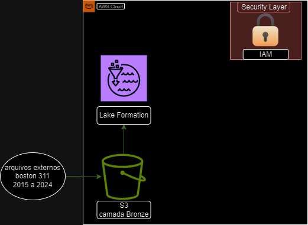

# Projeto: Construção de uma Pipeline de Dados Externos na AWS

## Descrição
Neste projeto, desenvolvi uma pipeline de dados externos na AWS, utilizando uma variedade de serviços, incluindo IAM para gerenciamento de acesso e S3 para armazenamento de dados em camadas Bronze e Silver. Embora tenha criado apenas a estrutura inicial para a camada Silver, explorei ferramentas de gerenciamento de custos na AWS, como AWS Budget e CloudWatch. Aprofundei meus conhecimentos em programação Python, utilizando diversas bibliotecas para consumo e manipulação de dados externos.

## Atividades Realizadas
- Configuração dos serviços IAM e S3 na AWS.
- Criação de uma pipeline de ingestão de dados em camadas Bronze e Silver.
- Exploração de ferramentas de gerenciamento de custos, como AWS Budget e CloudWatch.
- Utilização de programação Python para manipulação de dados e criação de soluções personalizadas.
- Participação ativa nas atividades práticas para consolidar o aprendizado.

## Próximos Passos
- Continuar explorando e aprimorando habilidades em AWS e Python.
- Aplicar o conhecimento adquirido em projetos futuros.

## Pipeline de Dados

